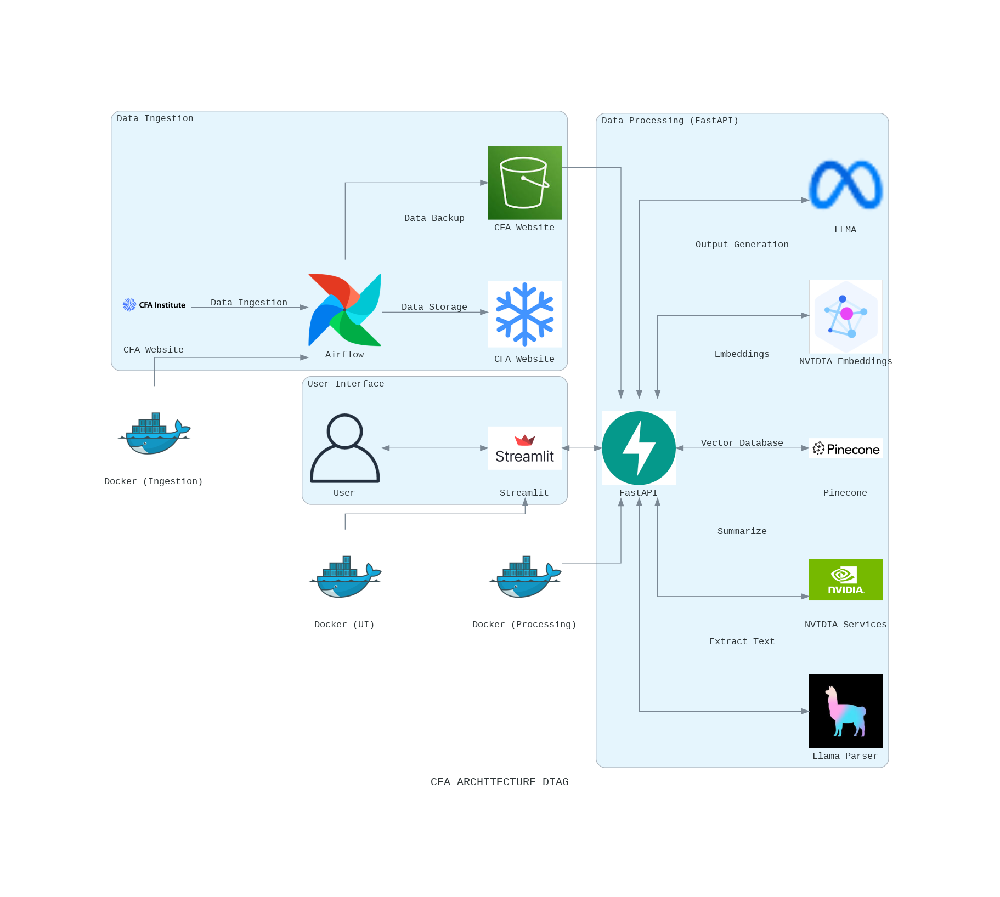

# Final Project

# CanvasGPT: Intelligent Canvas Management Assistant

### Goal of the Project
- Automate routine administrative tasks in Canvas LMS to reduce time burden
- Implement intelligent content organization across course sections
- Streamline creation and management of course announcements
- Optimize grading workflow efficiency
- Enhance content discovery and reusability
- Process and integrate academic materials from research databases
- Improve overall teaching productivity through AI assistance

### Project Overview
CanvasGPT is an innovative AI-powered application designed to transform how professors interact with Canvas Learning Management System (LMS). The system leverages advanced natural language processing to automate course management tasks, process academic materials from SpringerLink Research database, and provide an intuitive chat interface for professors to efficiently manage their courses. Through integrated AI capabilities, secure data management, and automated workflows, CanvasGPT serves as a personal Canvas assistant, enabling educators to focus more on teaching and student engagement rather than administrative tasks.

### Key Technologies Involved

- **Chrome Extension**: Custom UI development for direct Canvas integration and chat interface
- **Streamlit**: Admin dashboard development for monitoring and analytics
- **FastAPI**: High-performance REST API development with async support
- **OpenAI Models**: Natural language processing and document understanding
- **Azure Cloud Storage**: Secure file storage and document management
- **Snowflake DB**: Structured data storage for course and user information
- **Pinecone**: Vector database for semantic search and document retrieval
- **Docling**: Parsing documents and extracting structured information. 
- **Apache Airflow**: Orchestration of ETL pipelines and scheduling tasks
- **LlamaParser**: Document parsing and text extraction from various formats
- **Docker**: Application containerization and environment standardization
- **Git Actions**: CI/CD pipeline automation and testing
- **GitLab**: Version control and project management
- **Langraph**: Conversation flow management and dialogue state handling
- **NV-Embed Embeddings**: Document vectorization for semantic search
- **HTML/CSS**: Frontend styling and layout
- **JavaScript**: Client-side functionality and Canvas API integration 

###Project Plan and Timeline
```mermaid
flowchart LR
    subgraph M1[Milestone 1: Foundation]
        direction TB
        A1[Setup] --> A2[POC]
        A2 --> A3[Chatbot]
        A4["<b>Nov 20-24</b>"]
    end

    subgraph M2[Milestone 2: Infrastructure]
        direction TB
        B1[S3] --> B2[Snowflake]
        B2 --> B3[PDF Process]
        B3 --> B4[Testing]
        B5["<b>Nov 25-Dec 2</b>"]
    end

    subgraph M3[Milestone 3: Frontend & API]
        direction TB
        C1[Extension] --> C2[LLM]
        C2 --> C3[FastAPI]
        C4["<b>Nov 24-30</b>"]
    end

    subgraph M4[Milestone 4: Agent System]
        direction TB
        D1[Agents] --> D2[Integration]
        D2 --> D3[Testing]
        D4["<b>Nov 29-Dec 10</b>"]
    end

    subgraph M5[Milestone 5: Deployment]
        direction TB
        E1[Deploy] --> E2[CI/CD]
        E2 --> E3[Final Test]
        E4["<b>Dec 8-13</b>"]
    end

    M1 --> M2
    M2 --> M3
    M3 --> M4
    M4 --> M5

    style M1 fill:#e6f3ff
    style M2 fill:#fff0e6
    style M3 fill:#e6ffe6
    style M4 fill:#ffe6e6
    style M5 fill:#e6e6ff
    style A4 fill:#ffffff,stroke:#000000
    style B5 fill:#ffffff,stroke:#000000
    style C4 fill:#ffffff,stroke:#000000
    style D4 fill:#ffffff,stroke:#000000
    style E4 fill:#ffffff,stroke:#000000


## Project Resources

Google codelab: []

Google collab notebook: []

### Architecture diagram ###




### Deployment
The system is deployed on **Google Cloud Platform (GCP)**, using Docker for containerized deployment:
- **Docker**: Containers manage FastAPI and Streamlit, with Docker Compose orchestrating the components for consistent deployment.
- **GCP**: Ensures public access to the application and scalable infrastructure to accommodate user demand.


### Additional Notes
WE ATTEST THAT WE HAVEN’T USED ANY OTHER STUDENTS’ WORK IN OUR ASSIGNMENT AND ABIDE BY THE POLICIES LISTED IN THE STUDENT HANDBOOK. 


